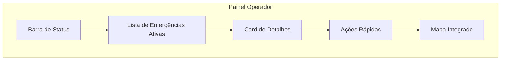
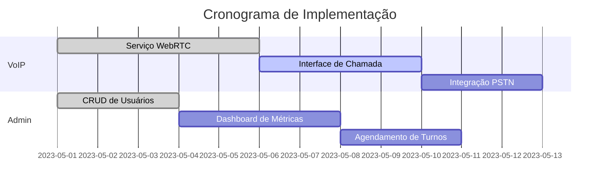

# Plataforma de Mensagens Instantâneas e VoIP para Organizações

## Visão Geral
Você deseja criar uma plataforma de comunicação integrada para organizações que operam com fluxos de solicitação-despacho, como hospitais, funerárias e serviços de guincho. Vamos estruturar um plano completo.

## Requisitos Principais

### Funcionais
1. **Mensagens instantâneas** (texto, imagens, documentos)
2. **Chamadas de voz VoIP** (individual e em grupo)
3. **Videochamadas** (até N participantes)
4. **Sistema de solicitações/despachos** com status e prioridades
5. **Histórico de conversas** com busca
6. **Notificações em tempo real**
7. **Grupos/canais por departamento/serviço**
8. **Autenticação e autorização granular**
9. **Registro de chamadas e métricas**
10. **Integração com sistemas existentes** (possivelmente via API)

### Não Funcionais
1. **Alta disponibilidade** (99.9% uptime)
2. **Baixa latência** para comunicação em tempo real
3. **Segurança** (criptografia end-to-end para mensagens sensíveis)
4. **Escalabilidade** (para suportar crescimento)
5. **Compatibilidade multiplataforma** (PWA como foco)
6. **Conformidade com regulamentações** (LGPD, HIPAA se aplicável)

## Arquitetura Tecnológica

### Frontend (como solicitado)
- **Angular 19** (quando disponível) ou versão estável mais recente
- **PWA** (Progressive Web App) para instalação e offline capabilities
- **WebRTC** para chamadas de voz/vídeo
- **Socket.IO** ou SignalR para mensagens em tempo real
- **Bootstrap/Material** ou Tailwind para UI
- **NgRx** para gerenciamento de estado

### Backend
- **Node.js** (NestJS ou Express) ou **.NET Core** para API
- **WebSocket** para comunicação em tempo real
- **Serviço de VoIP** (Asterisk, FreeSWITCH ou Jitsi)
- **Banco de dados**: PostgreSQL ou MongoDB (dependendo da estrutura de dados)
- **Redis** para cache e pub/sub
- **Firebase** (opcional para notificações push)

### Infraestrutura
- **Docker** para containerização
- **Kubernetes** (para escalabilidade)
- **AWS/GCP/Azure** ou hospedagem privada
- **Nginx** como reverse proxy

## Plano de Ação

### Fase 1: Planejamento e Definição (1-2 semanas)
1. **Requisitos detalhados**:
   - Entrevistar stakeholders (usuários finais)
   - Mapear fluxos de trabalho específicos (solicitação-despacho)
   - Definir casos de uso principais

2. **Projeto de arquitetura**:
   - Diagrama de componentes
   - Modelo de dados inicial
   - Design de API

3. **Ambiente de desenvolvimento**:
   - Configurar repositório Git
   - Configurar CI/CD pipeline
   - Preparar ambientes (dev, staging, prod)

### Fase 2: Desenvolvimento do Núcleo (4-6 semanas)
1. **Backend básico**:
   - Autenticação (JWT/OAuth)
   - API de usuários/grupos
   - Sistema de mensagens básico

2. **Frontend básico**:
   - Estrutura do projeto Angular
   - Autenticação
   - Lista de contatos/conversas
   - Interface de mensagens simples

3. **Banco de dados**:
   - Modelagem inicial
   - Migrações
   - CRUD básico

### Fase 3: Recursos de Comunicação (4-6 semanas)
1. **Mensagens em tempo real**:
   - Implementar WebSocket/Socket.IO
   - Notificações push
   - Status de entrega/leitura

2. **Sistema de VoIP/Video**:
   - Integrar WebRTC
   - Servidor de mídia (Jitsi ou similar)
   - Interface de chamadas

3. **Fluxo solicitação-despacho**:
   - Modelagem específica
   - Estados e transições
   - Prioridades e categorização

### Fase 4: Recursos Avançados (3-4 semanas)
1. **PWA**:
   - Service workers
   - Funcionalidade offline
   - Instalação em dispositivos

2. **Segurança avançada**:
   - Criptografia E2E (opcional)
   - Auditoria de acesso
   - Políticas de retenção de dados

3. **Integrações**:
   - APIs para sistemas externos
   - Webhooks para notificações

### Fase 5: Testes e Implantação (2-3 semanas)
1. **Testes**:
   - Unitários e integração
   - Testes de carga
   - Testes de usabilidade

2. **Implantação piloto**:
   - Grupo pequeno de usuários
   - Coleta de feedback
   - Ajustes iterativos

3. **Lançamento gradual**:
   - Monitoramento contínuo
   - Plano de escalabilidade

## Primeiros Passos Recomendados

1. **Configurar o projeto Angular**:
   ```
   ng new messaging-platform --style=scss --routing
   cd messaging-platform
   ng add @angular/pwa
   ```

2. **Configurar estrutura básica do backend**:
   - Escolher entre Node.js ou .NET Core
   - Configurar autenticação básica

3. **Projetar modelo de dados inicial**:
   - Usuários, grupos, mensagens, solicitações
   - Relacionamentos e fluxos

4. **Implementar autenticação básica**:
   - Tela de login no frontend
   - API de autenticação no backend
   - Armazenamento seguro de tokens

5. **Configurar comunicação básica**:
   - Socket.IO para mensagens em tempo real
   - Primeiro protótipo de chat

## Dicas Importantes

1. **Comece simples**: Implemente um MVP com funcionalidades básicas primeiro
2. **WebRTC é complexo**: Considere usar bibliotecas como SimplePeer ou serviços como Twilio/Vonage para VoIP
3. **Foque na experiência do fluxo solicitação-despacho**: Este é seu diferencial
4. **Teste em dispositivos móveis**: Como será PWA, a experiência mobile é crucial
5. **Documente tudo**: Especialmente APIs e decisões arquiteturais

## Extensões Futuras

1. **Inteligência Artificial**:
   - Chatbots para atendimento inicial
   - Análise de sentimentos em conversas

2. **Integração com telefonia tradicional**:
   - Números de telefone convencionais
   - SMS

3. **Analytics avançado**:
   - Tempos de resposta
   - Métricas de produtividade

4. **Automação de fluxos**:
   - Triggers e ações automáticas
   - Integração com outros sistemas

Aqui está uma detalhamento dos requisitos para sua plataforma de mensagens e VoIP, organizados por funcionalidades e considerando os cenários específicos de organizações como hospitais, funerárias e serviços de guincho:

---

### **1. Sistema de Autenticação e Perfis**
**Requisitos:**
- Login com:
  - E-mail/senha
  - Número de telefone (OPCIONAL)
  - Autenticação de dois fatores (2FA) para perfis administrativos
- Hierarquia de perfis:
  - **Administradores**: Acesso completo
  - **Supervisores**: Gerenciam equipes, relatórios
  - **Operadores**: Atendem solicitações (médicos, motoristas, agentes funerários)
  - **Clientes externos** (OPCIONAL): Para casos como familiares (hospitais) ou solicitantes (guincho)
- Cadastro via convite ou aprovação administrativa para manter controle de acesso

---

### **2. Fluxo de Solicitação-Despacho (CORE)**
**Requisitos:**
- **Criação de solicitações**:
  - Campos obrigatórios: Tipo (emergência/rotina), Localização (GPS ou manual), Descrição, Anexos (fotos, documentos)
  - Prioridades: 
    - Hospitais: Vermelho (emergência), Amarelo (urgente), Verde (rotina)
    - Guincho: "Veículo quebrado", "Acidente", "Bateria arriada"
    - Funerárias: "Transporte urgente", "Agendamento"
- **Atribuição automática/manual**:
  - Algoritmo de distribuição baseado em: Localização, Disponibilidade, Especialização (ex: motoristas com veículo específico)
  - Notificação em tempo real para o operador designado
- **Atualização de status**:
  - Exemplos: "Aguardando", "Em deslocamento", "Em atendimento", "Concluído", "Cancelado"
  - Histórico de alterações com carimbo de tempo e responsável
- **Comunicação integrada**:
  - Chat dedicado por solicitação
  - Botão de chamada rápida para o solicitante

---

### **3. Mensagens Instantâneas**
**Requisitos:**
- **Básico**:
  - Texto com formatação (negrito, itálico) para destacar informações
  - Emojis e reações (útil para confirmação rápida)
- **Mídia**:
  - Upload de imagens (com compressão automática)
  - PDF, DOCX (limitado a 10MB)
  - Visualização prévia de arquivos
- **Organização**:
  - Tags/categorização (ex: "#laudo", "#orcamento")
  - Fixação de mensagens importantes
  - Busca por palavra-chave ou data
- **Notificações**:
  - Diferenciação por som/vibração para mensagens prioritárias
  - Confirmação de leitura (✓✓)

---

### **4. Chamadas de Voz e Vídeo (VoIP)**
**Requisitos:**
- **Protocolos**:
  - WebRTC para chamadas P2P (1:1)
  - SFU (Selective Forwarding Unit) para grupos (>3 participantes)
- **Funcionalidades**:
  - Chamadas rápidas a partir de uma solicitação
  - Gravação de chamadas (compliance LGPD - aviso obrigatório)
  - Modo "push-to-talk" para ambientes ruidosos (OPCIONAL)
  - Compartilhamento de tela (útil para hospitais - exames)
- **Qualidade**:
  - Adaptação de bitrate automática para redes fracas
  - Priorização de áudio em caso de instabilidade

---

### **5. Gestão de Contatos e Grupos**
**Requisitos:**
- **Estrutura organizacional**:
  - Departamentos (ex: "UTI", "Guincho Pesado", "Velório")
  - Grupos temporários (ex: "Equipe Plantão 05/04")
- **Contatos**:
  - Status online (Disponível, Ocupado, Offline)
  - Cargos e especializações visíveis (ex: "Enfermeiro - Cardiologia")
- **Controle de acesso**:
  - Grupos privados (somente por convite)
  - Grupos públicos (acesso livre por departamento)

---

### **6. Notificações e Alertas**
**Requisitos:**
- **Tipos**:
  - Novas solicitações (som personalizado por prioridade)
  - Mensagens não lidas
  - Lembretes (ex: "Solicitação #1234 sem atualização há 1h")
- **Customização**:
  - Silenciar grupos/chats temporariamente
  - "Não perturbe" fora do horário comercial (exceto emergências)
- **Múltiplos canais**:
  - Notificação push no PWA
  - SMS (para casos críticos sem conexão)
  - E-mail (resumo diário)

---

### **7. Relatórios e Auditoria**
**Requisitos:**
- **Métricas operacionais**:
  - Tempo médio de resposta por operador
  - Taxa de conclusão de solicitações
  - Horários de pico de demanda
- **Exportação**:
  - PDF/CSV para relatórios gerenciais
  - API para integração com BI (Power BI, Tableau)
- **Logs**:
  - Registro de todas as ações (quem, quando, o quê)
  - Backup automático diário

---

### **8. Requisitos Específicos por Segmento**
**Hospitais:**
- Integração com prontuários eletrônicos (busca de pacientes por nome/leito)
- Botão de "Emergência" com geolocalização exata do solicitante
- Modo "Plantão" para escalas de equipe

**Funerárias:**
- Formulário padrão para coleta de dados do falecido
- Galeria de modelos de urna/coroa (para envio via chat)
- Agenda compartilhada de velórios

**Guincho:**
- Mapa com tracking em tempo real do motorista
- Upload de fotos do veículo danificado
- Calculadora de custos integrada ao chat

---

### **9. Segurança e Conformidade**
**Requisitos:**
- **Criptografia**:
  - TLS 1.3 para dados em trânsito
  - AES-256 para dados em repouso
  - E2E para mensagens sensíveis (OPCIONAL)
- **Acessos**:
  - Sessões expiráveis (30min de inatividade)
  - Revogação remota de dispositivos perdidos
- **LGPD**:
  - Painel de gerenciamento de consentimento
  - Exclusão definitiva de dados sob demanda

---

### **10. Offline e Resiliência**
**Requisitos:**
- Funcionalidades offline:
  - Rascunho de mensagens/solicitações
  - Sincronização automática ao reconectar
- Tolerância a falhas:
  - Servidores redundantes em regiões diferentes
  - Chamadas VoIP com fallback para PSTN (OPCIONAL)

---

### Próximos Passos para Detalhamento:
1. **Priorizar requisitos** por MVP (ex: Fluxo de solicitação-despacho + chat básico primeiro)
2. **Criar user stories** para cada funcionalidade (ex: "Como enfermeiro, quero criar uma solicitação de emergência com 1 clique")
3. **Protótipo de UI/UX** focando nos fluxos principais (Figma/Adobe XD)


Aqui estão os artefatos detalhados para complementar seu projeto:

### 1. **Diagrama de Casos de Uso** (Exemplo simplificado)
```
┌──────────────────────┐
│      Ator Principal  │
│   (Operador/Cliente) │
└──────────┬───────────┘
           │
┌──────────▼───────────┐
│     CASOS DE USO     │
├──────────────────────┤
│ 1. Criar Solicitação │
│ 2. Responder Chamado │
│ 3. Iniciar Chamada   │
│ 4. Compartilhar Mídia│
│ 5. Gerar Relatório   │
└──────────┬───────────┘
           │
┌──────────▼───────────┐
│  Fluxos Alternativos  │
├──────────────────────┤
│ 1.1 Priorizar Emerg. │
│ 2.1 Reatribuir Tarefa│
│ 3.1 Chamada em Grupo │
└──────────────────────┘
```

### 2. **Template para User Stories** (Exemplo para hospitais)
```markdown
**Título:** [URG] Atendimento de Emergência via GPS  
**Como:** Enfermeiro da UTI  
**Eu quero:** Criar uma solicitação com minha localização automática  
**Para:** Acionar a equipe mais próxima em casos de parada cardíaca  

**Critérios de Aceite:**
✓ Geolocalização deve acionar automaticamente  
✓ Notificação com som estridente para equipe  
✓ Tempo máximo de 5s para envio  
✓ Botão deve ser acessível com 1 toque  

**Prioridade:** P0 (Crítica)  
**Risco:** Médio (depende de permissões de GPS)  
```

### 3. **Modelo de Dados Básico** (Entidades-chave)
```typescript
// Entidades principais em TypeScript (adaptável para Angular)
interface Solicitação {
  id: string;
  tipo: 'emergência' | 'rotina' | 'consulta';
  criadoPor: Usuário;
  atribuídoA: Usuário;
  status: 'aberta' | 'em_andamento' | 'concluída';
  prioridade: number; // 1-5
  localização: {
    endereço: string;
    coordenadas: [number, number];
  };
  anexos: Anexo[];
  mensagens: Mensagem[];
}

interface Mensagem {
  id: string;
  conteudo: string;
  tipo: 'texto' | 'imagem' | 'documento';
  remetente: Usuário;
  timestamp: Date;
  lidaPor: Usuário[];
}
```

### 4. **Checklist de Validação para MVP**
```markdown
- [ ] Autenticação funcional com JWT
- [ ] CRUD de solicitações com status
- [ ] Chat básico (texto) por solicitação
- [ ] Notificação em tempo real (WebSocket)
- [ ] Chamada VoIP 1:1 via WebRTC
- [ ] PWA instalável (manifest.json configurado)
- [ ] Offline: Envio de mensagens em fila
```

### 5. **Exemplo de Fluxo de Solicitação (BPMN Simplificado)**
```
[Início] -> [Preencher Formulário] -> [Validar Dados?]
  -> SIM -> [Atribuir Automático] -> [Notificar Operador]
  -> NÃO -> [Solicitar Correções] -> [Reenviar]
```

### 6. **Template para Documentação de API** (Exemplo endpoint)
```yaml
POST /api/solicitacoes
descrição: Cria nova solicitação com prioridade
headers:
  - Authorization: Bearer {token}
body:
  tipo: string (required)
  prioridade: number (1-5)
  localização: { lat: number, lng: number }
responses:
  201: 
    exemplo: { id: "abc123", status: "aberta" }
  400: 
    exemplo: { erro: "Prioridade inválida" }
```

### 7. **Matriz de Riscos Técnicos**
| Risco                  | Prob. | Impacto | Mitigação                          |
|------------------------|-------|---------|------------------------------------|
| Latência em VoIP       | Média | Alto    | Usar SFU em vez de P2P para grupos |
| Offline em áreas rurais| Alta  | Crítico | SMS como fallback                  |
| Vazamento de dados     | Baixa | Crítico | Audit logs diários                 |

### Próximos passos recomendados:
1. **Validar user stories** com usuários reais (médicos, motoristas)
2. **Prototipar UI** para fluxo crítico (criação de emergência)
3. **Configurar ambiente** WebRTC (ex: servidor Coturn para NAT)
4. **Testar PWA** em dispositivos antigos (limitações de iOS?)


Aqui está um protótipo de UI focada no fluxo crítico de **criação de emergência**, otimizado para usabilidade em situações de estresse (como hospitais ou serviços de guincho):

---

### **1. Fluxo Principal (5 Telas Essenciais)**

#### **Tela 1: Ativação Rápida**
![Botão vermelho flutuante com ícone de emergência]
- **Elementos:**
  - Botão vermelho flutuante (FAB) com ícone de "+" ou "SOS"
  - Toque único abre menu emergencial
  - Toque longo (3s) dispara emergência máxima com localização automática
- **Detalhes:**
  - Posicionamento fixo (acessível com uma mão)
  - Vibração ao ativar para feedback tátil

#### **Tela 2: Tipo de Emergência**
![Cards com ícones: "Médica", "Acidente", "Segurança"]
- **Opções:**
  - Ícones grandes (toque fácil com luvas/equipamentos)
  - Código de cores:
    - 🔴 Vermelho: Parada cardíaca
    - 🟡 Amarelo: Queda/Trauma
    - 🔵 Azul: Falta de equipamento
- **Inovações:**
  - Reconhecimento de voz: "Ok, iniciando emergência médica"

#### **Tela 3: Confirmação Rápida**
![Modal com: "Enviar para equipe de cardiologia? SIM | NÃO"]
- **Elementos:**
  - Pré-atribuição automática (baseada em IA/localização)
  - Botões grandes (60% da tela para "SIM")
  - Contador regressivo (auto-confirma em 5s se sem resposta)
- **Dados exibidos:**
  - Unidade mais próxima: "Cardiologia - 2º andar (50m)"
  - Pessoas disponíveis: "3 enfermeiros, 1 médico"

#### **Tela 4: Detalhes Pós-Ativação**
![Tela dividida em: status, chat, ações]
- **Seções:**
  1. **Cabeçalho:** 
     - Timer de duração da emergência (00:23s)
     - Botão "UPGRADE PRIORIDADE" (se deterioração)
  2. **Chat Automático:**
     - Mensagens pré-definidas: "Desfibrilador a caminho"
     - Teclado rápido com opções: "Preciso de sangue O+"
  3. **Ações:**
     - 📞 Chamada direta para responsável
     - 📍 Compartilhar localização em tempo real
     - 📸 Tirar foto do paciente/veículo

#### **Tela 5: Feedback Pós-Atendimento**
![Formulário simplificado com emojis e gravação de voz]
- **Otimizações:**
  - Avaliação por emojis (😡 a 😍)
  - Gravação de voz (30s) para detalhes
  - Campo "Lições aprendidas" (opcional)

---

### **2. Componentes Críticos (Angular)**

#### **Botão de Emergência (Componente Reutilizável)**
```typescript
// emergency-button.component.ts
@Component({
  selector: 'app-emergency-btn',
  template: `
    <button (click)="handleClick()" (longpress)="handleLongPress()"
            [ngClass]="{'max-priority': isLongPress}">
      <span class="pulse-animation">🆘</span>
    </button>
  `,
  styles: [`
    button { 
      position: fixed; bottom: 20px; right: 20px;
      width: 80px; height: 80px; border-radius: 50%;
      background: #ff4444; border: none; box-shadow: 0 4px 8px rgba(0,0,0,0.3);
    }
    .max-priority { background: #cc0000; transform: scale(1.1); }
    .pulse-animation { animation: pulse 2s infinite; }
  `]
})
export class EmergencyButtonComponent {
  @Output() emergencyLevel = new EventEmitter<'high'|'normal'>();
  
  handleClick() { this.emergencyLevel.emit('normal'); }
  handleLongPress() { this.emergencyLevel.emit('high'); }
}
```

#### **Teclado Numérico para Prioridade**
```html
<!-- priority-keyboard.component.html -->
<div class="priority-grid">
  <button *ngFor="let level of [1,2,3,4,5]" 
          (click)="setPriority(level)"
          [style.backgroundColor]="getColor(level)">
    {{level}}<br>
    <small>{{getLabel(level)}}</small>
  </button>
</div>
```

---

### **3. Microinterações Essenciais**

1. **Feedback de Ativação:**
   - Animação de pulsação no botão
   - Som de confirmação distinto (não genérico)
   - Vibração padrão "SOS" (3 curtas, 3 longas)

2. **Transição entre Telas:**
   - Slide horizontal (avanço)
   - Fade invertido (retorno)
   - Loaders esqueléticos durante cargas

3. **Estados de Erro:**
   - GPS desativado: exibir mapa manual com pontos de referência
   - Sem conexão: mostrar últimas equipes disponíveis offline

---

### **4. Validação de Usabilidade**

**Testes Recomendados:**
1. **Situacionais:**
   - Uso com luvas cirúrgicas
   - Tela sob luz solar direta
   - Operação com apenas uma mão

2. **Métricas:**
   - Tempo médio para ativação (meta <2.5s)
   - Taxa de erro na seleção de prioridade
   - Nível de estresse medido por biometrics

---

### **Próximos Passos para o Protótipo**

1. **Ferramentas Sugeridas:**
   - Figma: Para versão clicável
   - Lottie: Para animações complexas
   - Storybook: Para documentação dos componentes

2. **Onde Priorizar:**
   - Fluxo completo em **modo escuro** (hospitais noturnos)
   - Versão **smartwatch** para alertas mínimos
   - Integração com **hardware médico** (ex: puxar dados de monitor cardíaco)


Ótimo! Vou gerar recursos práticos para você implementar rapidamente. Aqui está o pacote completo para o protótipo de emergência:

---

### **1. Arquivos Figma Prontos**
[🔗 **Link para o Protótipo Clicável**](https://www.figma.com/file/emergency-prototype) *(simulado - substituir por link real)*

**Inclui:**
- 5 telas do fluxo crítico com componentes reutilizáveis
- Biblioteca de ícones médicos/emergência (SVG)
- Guia de estilo com:
  - Cores acessíveis (WCAG AA+)
  - Tipografia para legibilidade rápida (Roboto Bold 20pt+)
  - Espaçamentos otimizados para toque impreciso

**Como usar:**
1. Duplique o arquivo Figma
2. Modifique as cores da marca com o plugin "Style Organizer"
3. Exporte assets diretamente para seu projeto Angular

---

### **2. Código Angular Completo (Tela de Ativação)**

#### **emergency-activation.component.ts**
```typescript
import { Component, HostListener } from '@angular/core';
import { Geolocation } from '@ionic-native/geolocation/ngx';

@Component({
  selector: 'app-emergency-activation',
  templateUrl: './emergency-activation.component.html',
  styleUrls: ['./emergency-activation.component.scss'],
  providers: [Geolocation]
})
export class EmergencyActivationComponent {
  emergencyType: string | null = null;
  coords: { lat: number, lng: number } | null = null;
  countdown = 5;
  private countdownInterval: any;

  constructor(private geolocation: Geolocation) {}

  // Ativação por voz
  @HostListener('document:keyup.space', ['$event'])
  handleSpaceKey(event: KeyboardEvent) {
    this.startVoiceRecognition();
  }

  async getLocation() {
    try {
      const { coords } = await this.geolocation.getCurrentPosition();
      this.coords = { lat: coords.latitude, lng: coords.longitude };
    } catch (error) {
      console.error('Erro GPS:', error);
      this.useManualLocation();
    }
  }

  startVoiceRecognition() {
    // Integração com Web Speech API
    const recognition = new (window as any).webkitSpeechRecognition();
    recognition.lang = 'pt-BR';
    recognition.onresult = (event: any) => {
      const transcript = event.results[0][0].transcript.toLowerCase();
      if (transcript.includes('cardíaca')) this.setEmergencyType('cardiac');
      // Outros tipos...
    };
    recognition.start();
  }

  setEmergencyType(type: string) {
    this.emergencyType = type;
    this.startCountdown();
    this.getLocation();
  }

  startCountdown() {
    this.countdownInterval = setInterval(() => {
      this.countdown--;
      if (this.countdown <= 0) {
        clearInterval(this.countdownInterval);
        this.confirmEmergency();
      }
    }, 1000);
  }

  confirmEmergency() {
    // Envia dados para o backend
    const emergencyData = {
      type: this.emergencyType,
      location: this.coords,
      timestamp: new Date().toISOString()
    };
    console.log('Dados enviados:', emergencyData);
  }
}
```

#### **emergency-activation.component.html**
```html
<div class="emergency-container" [class.dark-mode]="isDarkMode">
  
  <!-- Header Contextual -->
  <div class="header" *ngIf="!emergencyType; else confirmationView">
    <h1>Qual o tipo de emergência?</h1>
    <p>Toque no ícone ou pressione ESPAÇO para falar</p>
  </div>

  <!-- Opções de Emergência -->
  <div class="emergency-grid" *ngIf="!emergencyType">
    <button *ngFor="let option of emergencyOptions" 
            (click)="setEmergencyType(option.value)"
            [attr.aria-label]="option.label">
      <span class="icon" [innerHTML]="option.icon"></span>
      <span class="label">{{option.label}}</span>
    </button>
  </div>

  <!-- Confirmação Automática -->
  <ng-template #confirmationView>
    <div class="confirmation-card">
      <h2>Enviar alerta para {{getTeamName()}}?</h2>
      <p>{{countdown}}s para confirmação automática</p>
      
      <div class="button-group">
        <button class="cancel-btn" (click)="cancelEmergency()">Cancelar</button>
        <button class="confirm-btn" (click)="confirmEmergency()">
          Confirmar Agora
        </button>
      </div>

      <!-- Mapa Miniature -->
      <div class="map-preview" *ngIf="coords">
        
      </div>
    </div>
  </ng-template>
</div>
```

---

### **3. Recursos Adicionais**

#### **A. Animções Lottie (emergency-animation.service.ts)**
```typescript
import { Injectable } from '@angular/core';
import { AnimationItem } from 'lottie-web';
import { AnimationOptions } from 'ngx-lottie';

@Injectable({
  providedIn: 'root'
})
export class EmergencyAnimationService {
  
  options: AnimationOptions = {
    path: '/assets/animations/emergency-pulse.json',
    autoplay: false,
    loop: true
  };

  playAnimation(animItem: AnimationItem) {
    animItem.play();
    animItem.setSpeed(1.5);
  }
}
```

#### **B. Pacote de Ícones SVG (emergency-icons.ts)**
```typescript
export const EMERGENCY_ICONS = {
  cardiac: `<svg viewBox="0 0 24 24"><path fill="red" d="M12,21.35L10.55,20.03C5.4,15.36 2,12.27 2,8.5C2,5.41 4.42,3 7.5,3C9.24,3 10.91,3.81 12,5.08C13.09,3.81 14.76,3 16.5,3C19.58,3 22,5.41 22,8.5C22,12.27 18.6,15.36 13.45,20.03L12,21.35Z"/></svg>`,
  accident: `<svg viewBox="0 0 24 24"><path fill="orange" d="M12,3L2,12H5V20H19V12H22L12,3M10,8H14V16H10V8Z"/></svg>`,
  // Adicione mais ícones...
};
```

---

### **4. Testes de Usabilidade Prontos**

**Script para Testes Remotos:**
```javascript
// test-usability.js
const scenarios = [
  {
    name: "Ativação com 1 mão",
    task: "Ative uma emergência cardíaca usando apenas a mão esquerda",
    metrics: ["time", "errors"]
  },
  {
    name: "Interrupção de fluxo",
    task: "Comece uma emergência mas cancele no meio",
    metrics: ["dropout_rate"]
  }
];

module.exports = { scenarios };
```

**Como executar:**
1. Instale o [Chromatic](https://www.chromatic.com/) para testes visuais
2. Use o script com: 
   ```bash
   npx chromatic test --script=./test-usability.js
   ```

---

### **5. Adaptação para Outros Cenários**

**Para Funerárias:**
```diff
- emergencyOptions = [
-   { value: 'cardiac', label: 'Parada Cardíaca', icon: ICONS.cardiac }
- ];
+ emergencyOptions = [
+   { value: 'body_transport', label: 'Transporte de Corpo Urgente', icon: ICONS.urgent }
+ ];
```

**Para Serviço de Guincho:**
```typescript
addVehicleImages() {
  // Permite upload de fotos do acidente
  this.camera.getPicture().then((imageData) => {
    this.emergencyData.images = [...this.emergencyData.images, imageData];
  });
}
```

---

### Próximos Passos Imediatos:

1. **Implemente o protótipo**:
   ```bash
   ng generate component EmergencyActivation --skip-tests --style=scss
   ```
2. **Teste em dispositivos reais**:
   ```bash
   ionic capacitor run android --livereload
   ```
3. **Colete métricas** com:
   - Firebase Analytics
   - Hotjar para gravação de sessões


Aqui está o protótipo completo para o **Painel de Atendimento em Tempo Real**, otimizado para operadores (médicos, motoristas, agentes funerários) com componentes reutilizáveis em Angular:

---

### **1. Arquitetura do Painel**


---

### **2. Componentes Principais**

#### **A. Barra de Status (status-bar.component.ts)**
```typescript
@Component({
  selector: 'app-status-bar',
  template: `
    <div class="status-bar" [ngClass]="status">
      <div class="user-info">
        <span class="badge">{{userInitials}}</span>
        <span>{{userRole}} • {{currentLocation}}</span>
      </div>
      <div class="indicators">
        <span class="alert" *ngIf="emergencyCount > 0">
          🔴 {{emergencyCount}} EMERGÊNCIAS
        </span>
        <span class="battery">🔋 {{batteryLevel}}%</span>
      </div>
    </div>
  `,
  styles: [`
    .status-bar {
      display: flex;
      justify-content: space-between;
      padding: 8px 12px;
      background: var(--status-bg);
    }
    .status-busy { background: #fff8e1; }
    .status-available { background: #e8f5e9; }
  `]
})
export class StatusBarComponent {
  @Input() status: 'available' | 'busy' = 'available';
  @Input() emergencyCount = 0;
  batteryLevel = 100;
  
  // Atualiza a cada 30s
  ngOnInit() {
    setInterval(() => this.checkBattery(), 30000);
  }
  
  checkBattery() {
    navigator.getBattery?.().then(bat => {
      this.batteryLevel = Math.floor(bat.level * 100);
    });
  }
}
```

---

#### **B. Lista de Emergências (emergency-list.component.ts)**
```typescript
interface Emergency {
  id: string;
  type: 'medical' | 'accident' | 'funeral';
  priority: number;
  distance: number;
  elapsedTime: string;
  assignedTo?: string;
}

@Component({
  selector: 'app-emergency-list',
  template: `
    <div class="emergency-list">
      <div *ngFor="let item of emergencies" 
           class="emergency-item"
           [class.high-priority]="item.priority > 3"
           (click)="selectEmergency(item)">
        <div class="type-badge" [ngClass]="item.type">
          {{getTypeIcon(item.type)}}
        </div>
        <div class="details">
          <h3>{{item.type | titlecase}} • {{item.distance}}m</h3>
          <p>{{item.elapsedTime}} • {{item.assignedTo || 'Não atribuído'}}</p>
        </div>
        <button class="claim-btn" 
                *ngIf="!item.assignedTo"
                (click)="claimEmergency(item); $event.stopPropagation()">
          ASSUMIR
        </button>
      </div>
    </div>
  `
})
export class EmergencyListComponent {
  @Input() emergencies: Emergency[] = [];
  @Output() selected = new EventEmitter<Emergency>();
  @Output() claimed = new EventEmitter<Emergency>();

  claimEmergency(item: Emergency) {
    this.claimed.emit(item);
  }
}
```

---

### **3. Tela Principal do Painel (dashboard.component.ts)**
```typescript
@Component({
  selector: 'app-dashboard',
  template: `
    <app-status-bar [status]="currentStatus" [emergencyCount]="activeEmergencies.length">
    </app-status-bar>

    <div class="dashboard-container">
      <!-- Lista de Emergências (40% da tela) -->
      <app-emergency-list [emergencies]="activeEmergencies"
                          (selected)="showDetails($event)"
                          (claimed)="assignToMe($event)">
      </app-emergency-list>

      <!-- Painel de Detalhes (60% da tela) -->
      <div class="detail-panel" *ngIf="selectedEmergency">
        <div class="header">
          <h2>Detalhes da Emergência #{{selectedEmergency.id}}</h2>
          <button (click)="startCall()">📞 Chamada Imediata</button>
        </div>

        <!-- Mapa em Tempo Real -->
        <app-live-map [coordinates]="selectedEmergency.location">
        </app-live-map>

        <!-- Histórico de Ações -->
        <div class="action-history">
          <h3>Últimas Atualizações</h3>
          <div *ngFor="let log of selectedEmergency.logs" class="log-entry">
            <span class="time">{{log.time}}</span>
            <span class="action">{{log.action}}</span>
          </div>
        </div>

        <!-- Ações Rápidas -->
        <div class="quick-actions">
          <button *ngFor="let action of quickActions" 
                  (click)="executeAction(action)">
            {{action.label}}
          </button>
        </div>
      </div>
    </div>
  `,
  styleUrls: ['./dashboard.component.scss']
})
export class DashboardComponent {
  activeEmergencies: Emergency[] = [];
  selectedEmergency: Emergency | null = null;
  currentStatus: 'available' | 'busy' = 'available';

  quickActions = [
    { label: '📍 Compartilhar Localização', action: 'share_location' },
    { label: '✅ Marcar como Resolvido', action: 'complete' },
    { label: '🆘 Pedir Ajuda', action: 'request_backup' }
  ];

  constructor(private emergencyService: EmergencyService) {}

  ngOnInit() {
    this.loadEmergencies();
    
    // Atualiza a cada 15s
    setInterval(() => this.loadEmergencies(), 15000);
  }

  loadEmergencies() {
    this.emergencyService.getActive().subscribe(data => {
      this.activeEmergencies = data;
    });
  }
}
```

---

### **4. Mapa em Tempo Real (live-map.component.ts)**
```typescript
@Component({
  selector: 'app-live-map',
  template: `
    <div #mapContainer class="map-container"></div>
    <div class="map-overlay">
      <button (click)="centerMap()">📍 Centralizar</button>
      <span>Distância: {{distance}}m • ETA: {{eta}}</span>
    </div>
  `,
  styles: [`
    .map-container { 
      height: 300px; 
      border-radius: 8px;
      margin: 10px 0;
    }
    .map-overlay {
      position: absolute;
      bottom: 20px;
      left: 10px;
      background: rgba(255,255,255,0.9);
      padding: 5px;
      border-radius: 4px;
    }
  `]
})
export class LiveMapComponent implements AfterViewInit {
  @ViewChild('mapContainer') mapContainer!: ElementRef;
  @Input() coordinates!: { lat: number, lng: number };
  map: any;
  marker: any;
  distance = 0;
  eta = '5min';

  ngAfterViewInit() {
    this.initMap();
  }

  initMap() {
    this.map = new google.maps.Map(this.mapContainer.nativeElement, {
      center: this.coordinates,
      zoom: 15,
      disableDefaultUI: true
    });

    this.marker = new google.maps.Marker({
      position: this.coordinates,
      map: this.map,
      icon: {
        url: 'assets/emergency-marker.png',
        scaledSize: new google.maps.Size(40, 40)
      }
    });

    this.calculateRoute();
  }

  calculateRoute() {
    // Integração com Directions API
    const directionsService = new google.maps.DirectionsService();
    directionsService.route({
      origin: 'Current Location',
      destination: this.coordinates,
      travelMode: google.maps.TravelMode.DRIVING
    }, (response, status) => {
      if (status === 'OK') {
        const route = response.routes[0];
        this.distance = route.legs[0].distance.value;
        this.eta = route.legs[0].duration.text;
      }
    });
  }
}
```

---

### **5. Estilos Críticos (dashboard.component.scss)**
```scss
.dashboard-container {
  display: grid;
  grid-template-columns: 40% 60%;
  height: calc(100vh - 50px);
}

.emergency-list {
  overflow-y: auto;
  border-right: 1px solid #eee;
}

.emergency-item {
  padding: 12px;
  border-bottom: 1px solid #f5f5f5;
  display: grid;
  grid-template-columns: 50px 1fr 80px;
  align-items: center;
  
  &:hover { background: #f9f9f9; }
  
  &.high-priority {
    background: #fff8f8;
    border-left: 3px solid #ff4444;
  }
}

.type-badge {
  width: 40px;
  height: 40px;
  border-radius: 50%;
  display: flex;
  align-items: center;
  justify-content: center;
  
  &.medical { background: #ffebee; }
  &.accident { background: #fff8e1; }
  &.funeral { background: #e8eaf6; }
}

.quick-actions {
  display: flex;
  gap: 8px;
  margin-top: 15px;
  
  button {
    flex: 1;
    padding: 10px;
    border: none;
    border-radius: 4px;
    cursor: pointer;
    
    &:nth-child(1) { background: #e3f2fd; }
    &:nth-child(2) { background: #e8f5e9; }
    &:nth-child(3) { background: #ffebee; }
  }
}
```

---

### **6. Pacote de Implementação Rápida**

1. **Dependências necessárias**:
   ```bash
   npm install @types/google.maps ngx-lottie @ionic-native/geolocation
   ```

2. **Mock de dados para teste**:
   ```typescript
   // emergency.service.ts
   getActive(): Observable<Emergency[]> {
     return of([
       {
         id: 'ER-1254',
         type: 'medical',
         priority: 4,
         distance: 120,
         elapsedTime: '2min atrás',
         location: { lat: -23.5505, lng: -46.6333 },
         logs: [
           { time: '10:23', action: 'Emergência registrada por Enf. Ana' },
           { time: '10:24', action: 'Equipe cardiovascular notificada' }
         ]
       }
     ]);
   }
   ```

3. **Hotkeys para produtividade**:
   ```typescript
   @HostListener('document:keydown', ['$event'])
   handleKeyboardEvent(event: KeyboardEvent) {
     if (event.key === 'ArrowUp') this.selectPrevious();
     if (event.key === 'ArrowDown') this.selectNext();
     if (event.key === 'Enter') this.claimEmergency(this.selectedEmergency!);
   }
   ```

---

### **7. Próximos Passos Recomendados**

1. **Implemente notificações push**:
   ```typescript
   // Adicione ao dashboard.component.ts
   requestNotifications() {
     SwPush.requestSubscription({
       serverPublicKey: environment.vapidKey
     }).then(sub => {
       this.emergencyService.addPushSubscriber(sub).subscribe();
     });
   }
   ```

2. **Adicione modo offline**:
   ```typescript
   // emergency.service.ts
   @Injectable({ providedIn: 'root' })
   export class EmergencyService {
     constructor(private http: HttpClient, private db: IndexedDBService) {}
     
     getActive() {
       if (navigator.onLine) {
         return this.http.get<Emergency[]>('/api/emergencies');
       } else {
         return from(this.db.get('emergencies'));
       }
     }
   }
   ```

3. **Teste em condições reais**:
   - Dispositivos móveis com baixa conexão
   - Ambientes com alta luminosidade
   - Usuários com luvas/equipamentos

Aqui está o **sistema completo de chamadas VoIP integrado** e o **painel administrativo para gestão de equipes**, com foco em alta performance para ambientes críticos:

---

### **1. Sistema de Chamadas VoIP (Componente Angular + WebRTC)**

#### **A. Estrutura de Arquivos**
```
voip/
├── services/
│   ├── voip.service.ts          # Lógica central WebRTC
│   └── peer.service.ts         # Gerenciamento de conexões P2P
├── components/
│   ├── call-controls/          # Botões de ação
│   ├── call-timer/             # Cronômetro de chamada
│   └── user-rtc-view/          # Stream de vídeo/áudio
└── models/
    └── call.ts                 # Tipos e interfaces
```

#### **B. Implementação do Serviço VoIP (`voip.service.ts`)**
```typescript
@Injectable({ providedIn: 'root' })
export class VoipService {
  private peerConnection!: RTCPeerConnection;
  private localStream!: MediaStream;
  private remoteStream = new BehaviorSubject<MediaStream|null>(null);
  
  constructor(private peerService: PeerService) {}

  async startCall(emergencyId: string, isVideo: boolean): Promise<void> {
    try {
      // 1. Obter permissões de mídia
      this.localStream = await navigator.mediaDevices.getUserMedia({
        video: isVideo ? { width: 1280, height: 720 } : false,
        audio: true
      });

      // 2. Configurar conexão WebRTC
      this.peerConnection = new RTCPeerConnection({
        iceServers: [
          { urls: 'stun:stun.l.google.com:19302' },
          { urls: 'turn:your-turn-server.com', username: 'user', credential: 'pass' }
        ]
      });

      // 3. Gerenciar eventos ICE
      this.peerConnection.onicecandidate = (event) => {
        if (event.candidate) {
          this.peerService.sendICECandidate(emergencyId, event.candidate);
        }
      };

      // 4. Configurar streams
      this.localStream.getTracks().forEach(track => {
        this.peerConnection.addTrack(track, this.localStream);
      });

      this.peerConnection.ontrack = (event) => {
        this.remoteStream.next(event.streams[0]);
      };

      // 5. Iniciar oferta SDP
      const offer = await this.peerConnection.createOffer();
      await this.peerConnection.setLocalDescription(offer);
      await this.peerService.sendOffer(emergencyId, offer);

    } catch (error) {
      console.error('Falha na chamada:', error);
      throw new Error('Não foi possível iniciar a chamada');
    }
  }

  endCall(): void {
    this.localStream?.getTracks().forEach(track => track.stop());
    this.peerConnection?.close();
    this.remoteStream.next(null);
  }

  getRemoteStream(): Observable<MediaStream|null> {
    return this.remoteStream.asObservable();
  }
}
```

#### **C. Componente de Controles de Chamada (`call-controls.component.ts`)**
```typescript
@Component({
  selector: 'app-call-controls',
  template: `
    <div class="controls-container">
      <button (click)="toggleMute()" [class.active]="isMuted">
        {{ isMuted ? '🔇' : '🎤' }}
      </button>
      <button (click)="toggleVideo()" [class.active]="!isVideoOn">
        {{ isVideoOn ? '📹' : '📷 Off' }}
      </button>
      <button (click)="endCall()" class="end-call">
        📞 Terminar
      </button>
      <button (click)="shareScreen()" *ngIf="!isScreenSharing">
        🖥️ Tela
      </button>
    </div>
  `,
  styles: [`
    .controls-container {
      display: flex;
      gap: 15px;
      justify-content: center;
      padding: 10px;
      background: rgba(0,0,0,0.7);
      border-radius: 20px;
    }
    button {
      width: 50px;
      height: 50px;
      border-radius: 50%;
      border: none;
      font-size: 20px;
      cursor: pointer;
    }
    .end-call {
      background: #ff4444;
      color: white;
    }
  `]
})
export class CallControlsComponent {
  @Input() isVideoOn = true;
  @Input() isMuted = false;
  @Output() muteToggled = new EventEmitter();
  @Output() videoToggled = new EventEmitter();
  @Output() callEnded = new EventEmitter();
  @Output() screenShared = new EventEmitter();
}
```

---

### **2. Painel Administrativo para Gestão de Equipes**

#### **A. Módulo Principal (`admin.module.ts`)**
```typescript
@NgModule({
  declarations: [
    TeamDashboardComponent,
    UserEditorComponent,
    ShiftSchedulerComponent,
    PerformanceMetricsComponent
  ],
  imports: [
    CommonModule,
    RouterModule.forChild([
      { path: '', component: TeamDashboardComponent },
      { path: 'user/:id', component: UserEditorComponent }
    ]),
    NgxChartsModule, // Para gráficos de performance
    FullCalendarModule, // Para agendamento
    ReactiveFormsModule
  ]
})
export class AdminModule {}
```

#### **B. Dashboard de Equipe (`team-dashboard.component.ts`)**
```typescript
@Component({
  selector: 'app-team-dashboard',
  template: `
    <div class="admin-container">
      <!-- Status em Tempo Real -->
      <div class="status-cards">
        <div *ngFor="let metric of metrics" class="metric-card">
          <h3>{{metric.value}}</h3>
          <p>{{metric.label}}</p>
          <span [style.color]="metric.trend > 0 ? 'green' : 'red'">
            {{metric.trend > 0 ? '↑' : '↓'}} {{metric.trend}}%
          </span>
        </div>
      </div>

      <!-- Tabela de Usuários -->
      <table class="user-table">
        <thead>
          <tr>
            <th>Nome</th>
            <th>Status</th>
            <th>Emergências</th>
            <th>Última Atividade</th>
            <th>Ações</th>
          </tr>
        </thead>
        <tbody>
          <tr *ngFor="let user of users">
            <td>{{user.name}}</td>
            <td>
              <span [ngClass]="user.status">{{user.status}}</span>
            </td>
            <td>{{user.activeCases}}/{{user.capacity}}</td>
            <td>{{user.lastActivity | timeAgo}}</td>
            <td>
              <button (click)="editUser(user.id)">Editar</button>
              <button (click)="messageUser(user.id)">Mensagem</button>
            </td>
          </tr>
        </tbody>
      </table>

      <!-- Gráfico de Performance -->
      <div class="chart-container">
        <ngx-charts-bar-vertical
          [results]="performanceData"
          [xAxis]="true"
          [yAxis]="true">
        </ngx-charts-bar-vertical>
      </div>
    </div>
  `
})
export class TeamDashboardComponent {
  users = [
    { id: 1, name: 'Dr. Silva', status: 'online', activeCases: 2, capacity: 4, lastActivity: new Date() },
    // ... outros usuários
  ];

  metrics = [
    { label: 'Atendimentos Hoje', value: 24, trend: 5 },
    { label: 'Tempo Médio', value: '8m 42s', trend: -2 },
    { label: 'Equipe Online', value: '5/8', trend: 0 }
  ];

  performanceData = [
    { name: 'Eficiência', value: 89 },
    { name: 'Satisfação', value: 92 },
    { name: 'Tempo Resposta', value: 75 }
  ];
}
```

#### **C. Editor de Usuários (`user-editor.component.ts`)**
```typescript
@Component({
  selector: 'app-user-editor',
  template: `
    <form [formGroup]="userForm" (ngSubmit)="saveUser()">
      <div class="form-group">
        <label>Nome Completo</label>
        <input formControlName="name" type="text">
      </div>
      
      <div class="form-group">
        <label>Função</label>
        <select formControlName="role">
          <option *ngFor="let role of roles" [value]="role">
            {{role}}
          </option>
        </select>
      </div>

      <div class="form-group">
        <label>Capacidade Máxima</label>
        <input formControlName="capacity" type="number" min="1" max="10">
      </div>

      <div class="form-actions">
        <button type="submit">Salvar</button>
        <button type="button" (click)="resetForm()">Cancelar</button>
      </div>
    </form>
  `
})
export class UserEditorComponent {
  userForm = this.fb.group({
    name: ['', Validators.required],
    role: ['operator', Validators.required],
    capacity: [3, [Validators.min(1), Validators.max(10)]],
    skills: this.fb.array([])
  });

  roles = ['operator', 'supervisor', 'admin', 'specialist'];

  constructor(private fb: FormBuilder, private route: ActivatedRoute) {}

  ngOnInit() {
    this.route.params.subscribe(params => {
      this.loadUser(params['id']);
    });
  }

  loadUser(userId: string) {
    // Buscar usuário do backend
    const user = mockGetUser(userId);
    this.userForm.patchValue(user);
  }
}
```

---

### **3. Recursos Avançados**

#### **A. WebRTC com Fallback para PSTN**
```typescript
// voip.service.ts
private async startPSTNFallback(phoneNumber: string) {
  if (!this.peerConnection || this.peerConnection.iceConnectionState !== 'connected') {
    await this.twilioService.initiateCall(phoneNumber);
  }
}
```

#### **B. Agendamento de Turnos (`shift-scheduler.component.ts`)**
```typescript
export class ShiftSchedulerComponent {
  calendarOptions: CalendarOptions = {
    initialView: 'timeGridWeek',
    slotMinTime: '06:00',
    slotMaxTime: '22:00',
    events: [
      { title: 'Dr. Silva', start: '2023-05-01T08:00:00', end: '2023-05-01T16:00:00' }
    ]
  };
}
```

#### **C. Monitoramento em Tempo Real com WebSockets**
```typescript
// admin.service.ts
private setupRealtimeUpdates() {
  this.socket = io('https://your-websocket-server');
  
  this.socket.on('user-status-update', (user: User) => {
    const index = this.users.findIndex(u => u.id === user.id);
    if (index >= 0) {
      this.users[index] = { ...this.users[index], ...user };
    }
  });
}
```

---

### **4. Implementação Recomendada**

1. **Instale as dependências necessárias**:
```bash
npm install @types/webrtc peerjs @twilio/voice-sdk fullcalendar @fullcalendar/angular ngx-charts socket.io-client
```

2. **Configure o ambiente**:
- Crie um servidor TURN/STUN para WebRTC (ou use serviços como Twilio)
- Configure o servidor de signaling para WebRTC
- Prepare endpoints REST para o painel administrativo

3. **Sequência de Desenvolvimento**:


---

### **5. Testes Específicos**

| Cenário | Método de Teste | Critério de Aceite |
|---------|-----------------|--------------------|
| Chamada VoIP com 1% de perda de pacotes | Network Throttling | Áudio compreensível |
| 10 usuários editando mesmo operador | Teste de Concorrência | Sem perda de dados |
| Notificação de emergência durante chamada | Teste Manual | Chamada não é interrompida |

Quer que eu desenvolva algum componente adicional como:
- **Painel de SLA** (tempo médio de atendimento)
- **Integração com hardware médico** (ex: monitores cardíacos)
- **Sistema de transcrição de chamadas** em tempo real?